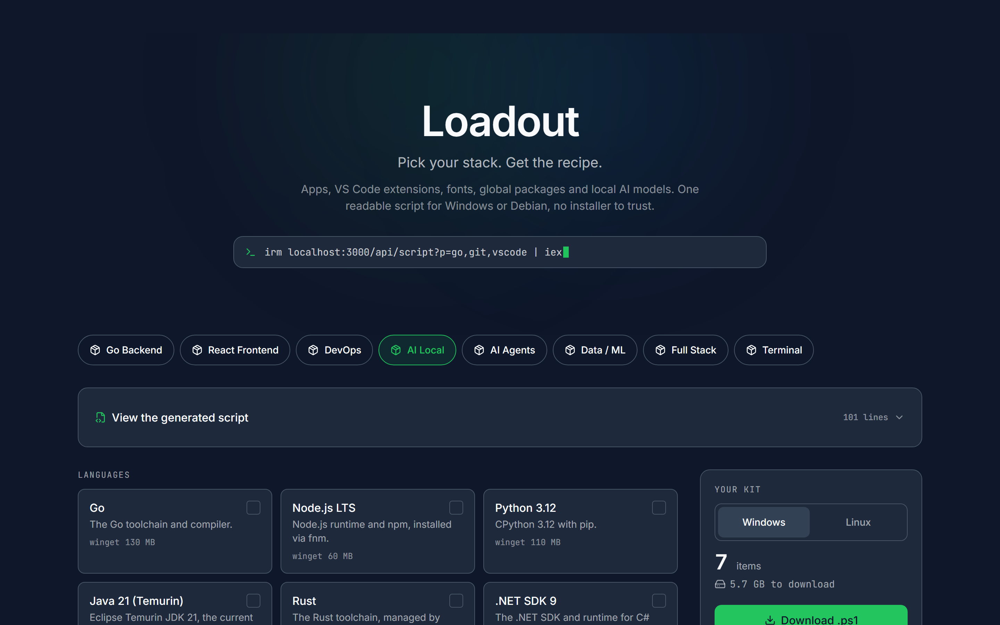
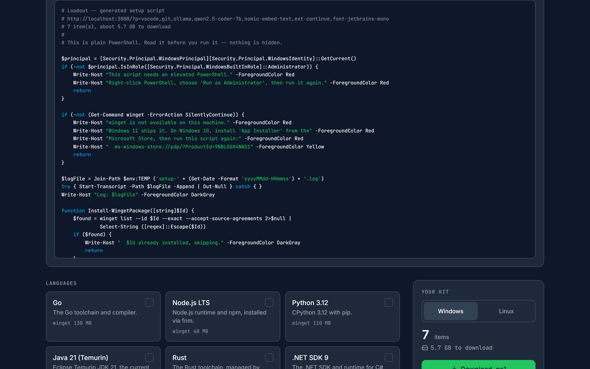

# Loadout

**Pick your stack. Get the recipe.**

Loadout is Ninite for Windows developers: tick apps, VS Code extensions, fonts,
global packages and local AI models out of a curated catalog, and get back one
readable install script that installs all of it — PowerShell for Windows 10 and
11, or bash for Debian and Ubuntu.

There is no installer to trust, no account, and no database. The selection
lives in the query string, so a link *is* the machine setup.

## The one-liner

```powershell
irm "loadout.vercel.app/api/script?p=go,git,vscode,ext-gitlens" | iex
```

Or download the same thing as a `.ps1` and read it first. That is the
recommended path, and the script says so in its own header.

### On Debian or Ubuntu

Add `&os=linux` and you get bash instead. The page has a Windows/Linux toggle
that does the same thing.

```bash
sudo bash -c "$(curl -fsSL 'https://loadout.vercel.app/api/script?p=go,git,ext-gitlens&os=linux')"
```

The quotes around the URL are not optional. Without them the `&` inside `$( )`
backgrounds the `curl`, `os=linux` runs as a shell assignment, and you get a
**PowerShell** script handed to bash — silently, with no error.

And it is `sudo bash -c "$(...)"`, never `curl ... | sudo bash`. The second form
gives the script no controlling terminal, so any prompt — an apt confirmation, a
sudo password — hangs forever with nothing printed.

Not everything in the catalog has a Linux equivalent. Twelve of the sixty-two
items do not: Docker Desktop and the WSL distros by nature, and a handful that
ship only an AppImage, a `.deb` or a tarball. Those stay visible and selectable,
get marked **Not available on Linux** on the card, are counted in a sidebar
warning before you download, and are named by the script itself at runtime for
anyone who never opened the page. They are never silently dropped.

## What it looks like



Pick a pack or tick items one at a time. The sidebar keeps a running count and
download total — Ollama models are 4 to 9 GB each, and nothing else warns you
before the download starts.



Expand the panel and the generated script is right there, re-rendered on every
tick, at a width where you can actually read it. It is byte-for-byte what
`/api/script` serves — asserted by a test, not assumed.

Selecting a VS Code extension pulls VS Code in as **Required by your
selection**: locked, still keyboard-reachable, and announced as unavailable
rather than silently skipped.

Captured from a production build at 1440x900.

## The generated script is readable by design

Nothing about the output is obfuscated, minified, or fetched at runtime. The
whole point of the project is that you can read the thing before you run it,
and the generator is built so that reading it is actually worth something:

- **One admin gate first.** If the shell is not elevated it prints how to fix
  that and returns. It never calls `exit` — under `irm | iex` that would close
  the user's console — and it never declares `param()`, which `iex` rejects
  outright.
- **Preflights only for what you picked.** A `winget` selection checks that
  `winget` exists and points Windows 10 users at App Installer. A WSL
  selection checks for build 19041+. A models-only run gets neither.
- **A transcript.** Everything is logged to `%TEMP%\setup-<timestamp>.log`.
- **One helper function per installer**, emitted only if that installer is
  used. Every helper checks whether the thing is already installed and skips
  it, so the script is safe to run twice.
- **Phases in dependency order**: `winget`, then WSL distros, fonts, VS Code
  extensions, npm globals, pipx packages, and Ollama model pulls last. `PATH`
  is refreshed in-session right after the `winget` phase, which is what lets
  the later phases find `code`, `npm` and `ollama` that `winget` installed
  seconds earlier. Models go last because they are the largest downloads —
  interrupt the script and everything else is already usable.
- **ASCII only.** No box drawing, no emoji, no accents. `irm | iex` decoding of
  non-ASCII is unreliable, so the emitter strips anything outside printable
  ASCII rather than trusting the catalog to behave.

## The catalog is the allowlist

This is the security model, and it is worth stating plainly: **no string from
the query string ever reaches the generated script.**

`?p=go,git,vscode` is not a list of things to install. It is a list of lookup
keys. `lib/url.ts` bounds and validates them, `lib/resolve.ts` looks each one
up in `data/catalog.ts` and **silently drops anything it does not recognise**,
and `lib/generate.ts` emits only the fields of the catalog entries that
survived. An id nobody wrote into `data/catalog.ts` cannot produce a single
character of output.

The second layer is for the catalog itself, because the catalog takes pull
requests. Every value emitted into PowerShell goes out as a single-quoted
literal with apostrophes doubled — single-quoted strings interpolate nothing,
so `$`, a backtick and a double quote are all inert inside one. Values that
land in a comment get the same treatment, so a newline in a name cannot end
the comment early and run as code. Font ids are additionally reduced to
`[a-zA-Z0-9-]` before they reach `Join-Path`, which does not normalise `..`.

None of this is theoretical: a `ref` containing a double quote was a working
code-execution bug in an earlier revision, found by running the output instead
of reading it.

## Adding a catalog item

Catalog entries live in `data/catalog.ts` and are plain data. Add one object:

```ts
{
  id: 'ripgrep',
  name: 'ripgrep',
  description: 'Recursive regex search that respects gitignore.',
  category: 'tools',
  installer: 'winget',
  ref: 'BurntSushi.ripgrep.MSVC',
  sizeMb: 5,
}
```

Two rules matter more than the rest:

1. **`id` is permanent.** It appears in every link anyone has ever shared.
   Renaming one silently breaks those links, because `resolve` drops ids it
   does not know.
2. **Verify the `ref` against the real registry before you commit it.** For
   `winget` that is `winget search --id <ref> --exact`. An invented package id
   is worse than a missing item — it becomes a failing command in somebody's
   elevated shell.

`CONTRIBUTING.md` has the full rules, and `lib/catalog.test.ts` enforces the
mechanical half of them.

## Local development

```bash
npm install
npm run dev     # http://localhost:3000
npm test        # vitest, the whole suite
npm run lint    # eslint, must be 0 errors
npm run build   # next build
```

### Where things live

| Path | Responsibility |
|---|---|
| `data/catalog.ts` | The catalog. Data only, and the allowlist. |
| `data/packs.ts` | Curated packs referencing catalog ids. Data only. |
| `lib/url.ts` | Parses `?p=`. The trust boundary — validates and caps input. |
| `lib/resolve.ts` | Expands `requires` transitively, dedupes, sums size. |
| `lib/generate.ts` | Emits the PowerShell. Owns helpers and phase order. |
| `lib/brand.ts` | Brand name and canonical URL. One constant each. |
| `app/api/script/route.ts` | Serves the script as `text/plain` or a `.ps1`. |

Built with Next.js 16, TypeScript, Tailwind v4 and shadcn/ui on Base UI.
Deployed on Vercel.
